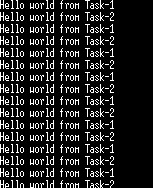
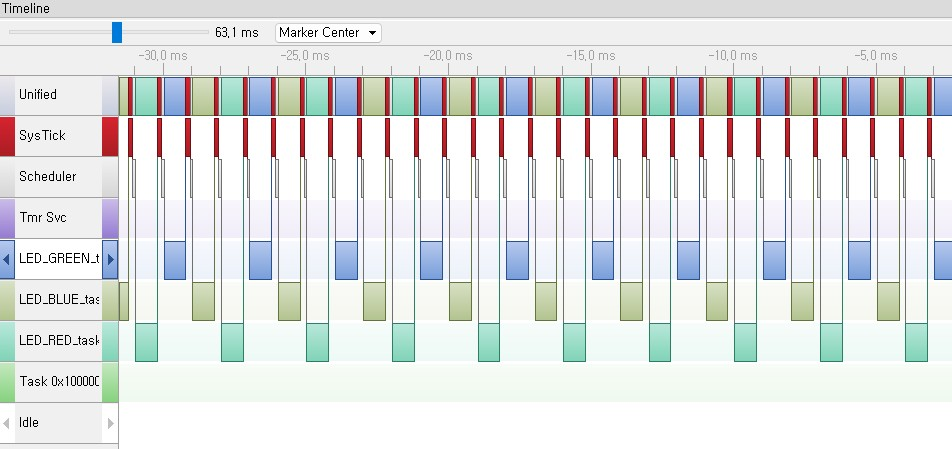
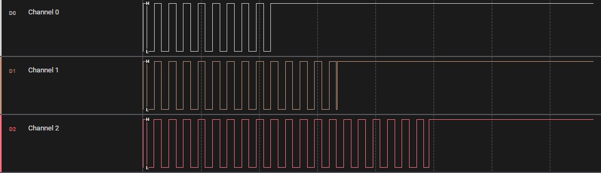
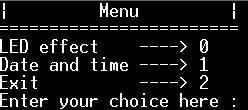
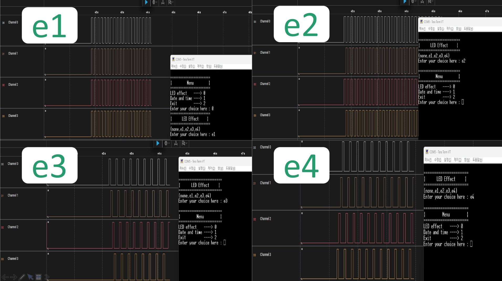
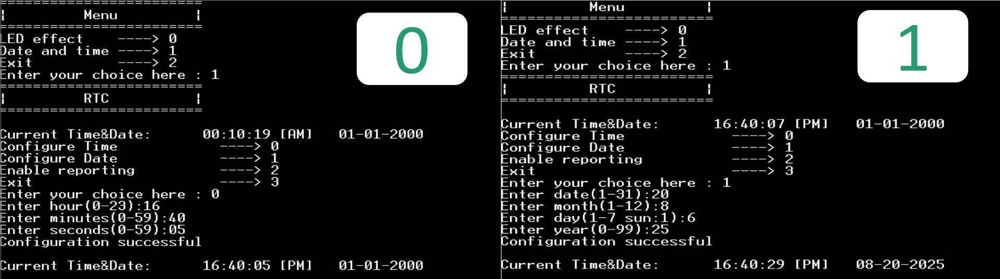
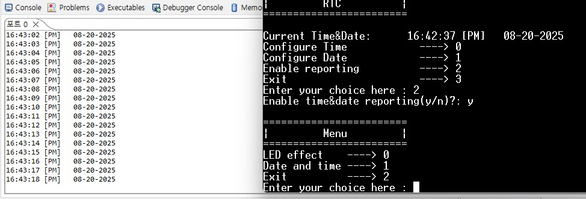

# stm32f103rbt6_freeRTOS_example

## 📘 개요
**STM32F103RB** 보드와 **FreeRTOS-Kernel v11.0**을 기반으로 작성된 예제 모음입니다.  
멀티태스킹, 태스크 제어, Queue, Timer 등의 기능을 구현했습니다.

---

## ⚙️ 개발 환경
- **MCU**: STM32F103RB (Cortex-M3)  
- **IDE**: STM32CubeIDE  
- **RTOS**: FreeRTOS-Kernel v11.0  
- **분석 툴**: Logic Analyzer (타이밍/신호 분석용), SEGGER J-Link v3.52(태스크 확인용)

---

## 📂 예제 설명

### 1️⃣ Example 1 - 멀티 태스크
- **기능**
  - Task1, Task2를 생성하여 번갈아 가면서 메시지 출력(FreeRTOS 스케줄링 동작 확인) 

---

### 2️⃣ Example 2 - LED 기본 제어
- **기능**
  - 3개의 LED를 번갈아 가면서 토글
  - Task Delay를 이용한 주기적 제어 

---

### 3️⃣ Example 3 - LED Block 제어
- **기능**
  - 3개의 LED를 번갈아 가면서 토글
  - `vTaskDelayUntil()`을 이용한 주기 유지

---

### 4️⃣ Example 4 - 버튼 입력 기반 태스크 중지/재개
- **기능**
  - 버튼을 누르면 Task1 → Task2 → Task3 순서대로 task suspend
  - 버튼을 2초 이상 길게 누르면 모든 태스크 재개
  - 버튼 이벤트 처리 + 태스크 Suspend/Resume 제어 

---

### 5️⃣ Example 5 - 버튼 인터럽트 기반 태스크 삭제
- **기능**
  - 버튼 인터럽트 발생 시 Task1 → Task2 → Task3 순서대로 taskdelete
  - `vTaskDelete()` API를 활용한 태스크 종료

---

### 6️⃣ Example 6 - Queue & Timer 기반 메뉴 프로그램

- **구성**
  -  LED 제어 모드 / Date & Time 모드

#### 메인 메뉴
- 메인 메뉴 화면 

#### 기능 1: LED Effect (입력: `0`)
- LED 제어 화면으로 진입 시, `e1 ~ e4` 중 하나를 입력하여 동작 선택
- `e1` → 4개의 LED를 동시에 토글   
- `e2` → 홀수/짝수 LED를 교대로 토글   
- `e3` → LED1 → LED2 → LED3 → LED4 순차 점등   
- `e4` → LED4 → LED3 → LED2 → LED1 역순 점등   

#### 기능 2: Date and Time (입력: `1`)
- RTC(Date/Time) 제어 화면으로 진입 시, 아래 메뉴 중 하나를 입력
- `0` → 원하는 시간(Time) 설정 
- `1` → 원하는 날짜(Date) 설정   
- `2` → 현재 디바이스 시간 SWV(Serial Wire Viewer) 출력 (디버깅 전용) 
   
  